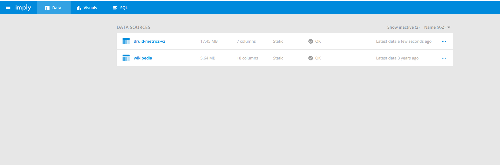
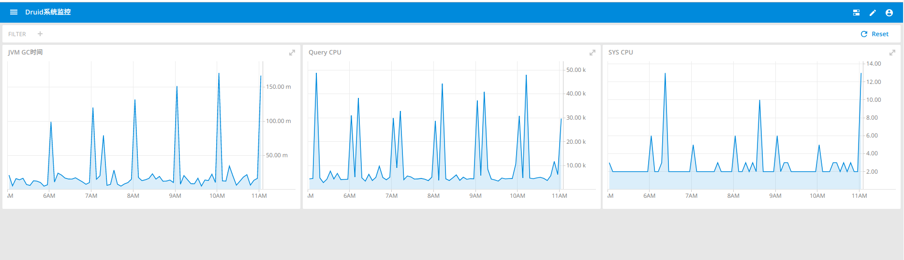
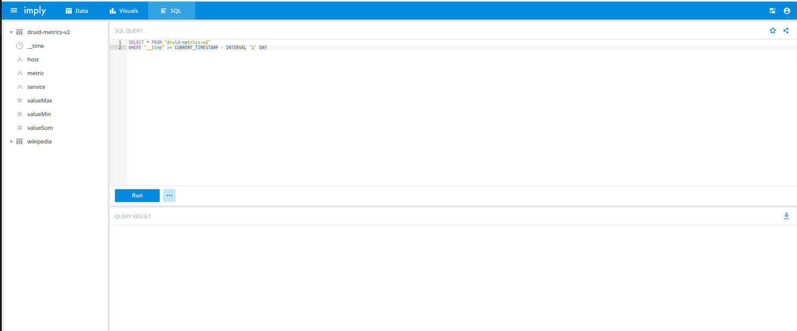

# Imply

下载链接 [https://imply.io](https://imply.io)

相关文档 [https://docs.imply.io/on-prem/quickstart](https://docs.imply.io/on-prem/quickstart)

下载得到`imply-2.9.16.tar.gz`，解压看到目录结构：

+ `bin/` - run scripts for included software.
+ `conf/` - template configurations for a clustered setup.
+ `conf-quickstart/*` - configurations for the single-machine quickstart.
+ `dist/` - all included software.
+ `quickstart/` - files related to the single-machine quickstart.

# 单机安装

新建文件`conf-quickstart/tranquility/server-log.json`

```
{
  "dataSources" : [
    {
      "spec" : {
        "dataSchema" : {
          "dataSource" : "druid-metrics-v2",
          "parser" : {
            "type" : "string",
            "parseSpec" : {
              "timestampSpec" : {
                "column" : "timestamp",
                "format" : "auto"
              },
              "dimensionsSpec" : {
                "dimensions" : ["host", "metric", "service"],
                "dimensionExclusions" : ["timestamp", "value"]
              },
              "format" : "json"
            }
          },
          "granularitySpec" : {
            "type" : "uniform",
            "segmentGranularity" : "hour",
            "queryGranularity" : "none"
          },
          "metricsSpec" : [
            {"type":"longSum", "name":"valueSum", "fieldName":"value"},{"type":"longMax", "name":"valueMax", "fieldName":"value"},{"type":"longMin", "name":"valueMin", "fieldName":"value"}
          ]
        },
        "ioConfig" : {
          "type" : "realtime"
        },
        "tuningConfig" : {
          "type" : "realtime",
          "maxRowsInMemory" : "50000",
          "intermediatePersistPeriod" : "PT10M",
          "windowPeriod" : "PT10M"
        }
      },
      "properties" : {
        "task.partitions" : "1",
        "task.replicants" : "1"
      }
    }
  ],
  "properties" : {
    "zookeeper.connect" : "localhost",
    "druid.discovery.curator.path" : "/druid/discovery",
    "druid.selectors.indexing.serviceName" : "druid/overlord",
    "http.port" : "8200",
    "http.threads" : "40",
    "serialization.format" : "smile",
    "druidBeam.taskLocator": "overlord"
  }
}
```

修改文件`conf-quickstart/druid/_common/common.runtime.properties`

```
#
# Monitoring
#

druid.monitoring.monitors=["org.apache.druid.java.util.metrics.SysMonitor","org.apache.druid.java.util.metrics.JvmMonitor","org.apache.druid.java.util.metrics.JvmCpuMonitor","org.apache.druid.java.util.metrics.CpuAcctDeltaMonitor","org.apache.druid.java.util.metrics.JvmThreadsMonitor"]
druid.emitter=http
druid.emitter.logging.logLevel=debug
druid.emitter.http.recipientBaseUrl=http://localhost:8200/v1/post/druid-metrics-v2
```

修改启动脚本`conf/supervise/quickstart.conf`

```
# Uncomment to use Tranquility Server
!p95 tranquility-server bin/tranquility server -configFile conf-quickstart/tranquility/server-log.json
```

启动

```
➜  imply-2.9.16 ./bin/supervise -c conf/supervise/quickstart.conf 
New version available: 2.9.17, you have: 2.9.16
[Fri Jun 28 11:35:33 2019] Running command[zk], logging to[/home/dubby/Desktop/imply-2.9.16/var/sv/zk]: bin/run-zk conf-quickstart
[Fri Jun 28 11:35:33 2019] Running command[coordinator], logging to[/home/dubby/Desktop/imply-2.9.16/var/sv/coordinator]: bin/run-druid coordinator conf-quickstart
[Fri Jun 28 11:35:33 2019] Running command[broker], logging to[/home/dubby/Desktop/imply-2.9.16/var/sv/broker]: bin/run-druid broker conf-quickstart
[Fri Jun 28 11:35:33 2019] Running command[router], logging to[/home/dubby/Desktop/imply-2.9.16/var/sv/router]: bin/run-druid router conf-quickstart
[Fri Jun 28 11:35:33 2019] Running command[historical], logging to[/home/dubby/Desktop/imply-2.9.16/var/sv/historical]: bin/run-druid historical conf-quickstart
[Fri Jun 28 11:35:33 2019] Running command[overlord], logging to[/home/dubby/Desktop/imply-2.9.16/var/sv/overlord]: bin/run-druid overlord conf-quickstart
[Fri Jun 28 11:35:33 2019] Running command[middleManager], logging to[/home/dubby/Desktop/imply-2.9.16/var/sv/middleManager]: bin/run-druid middleManager conf-quickstart
[Fri Jun 28 11:35:33 2019] Running command[imply-ui], logging to[/home/dubby/Desktop/imply-2.9.16/var/sv/imply-ui]: bin/run-imply-ui-quickstart conf-quickstart
[Fri Jun 28 11:35:33 2019] Running command[tranquility-server], logging to[/home/dubby/Desktop/imply-2.9.16/var/sv/tranquility-server]: bin/tranquility server -configFile conf-quickstart/tranquility/server-log.json

```

[http://localhost:9095/](http://localhost:9095/)







[http://localhost:8888](http://localhost:8888)


至此，单机版druid安装完成，并且这里把druid自身的监控指标作为数据源传给druid自己来存储和分析。